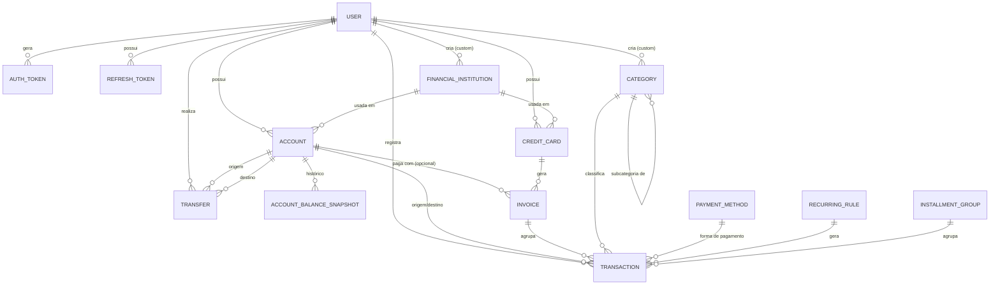

# Fase 2 — Modelagem de Dados (ERD)

> Detalha as entidades da seção 3 de [`01-planejamento.md`](01-planejamento.md), já incorporando as decisões: formas de pagamento em lista fixa, moeda única (BRL), notificação apenas in-app, investimentos fora do MVP.

## Diagrama de relacionamento

## Entidades e campos

### User
| Campo | Tipo | Observações |
|---|---|---|
| id | uuid | PK |
| first_name | string | |
| last_name | string | |
| email | string | unique, usado para login |
| password_hash | string | argon2id |
| theme_preference | enum(`light`,`dark`,`system`) | default `system` |
| created_at / updated_at | timestamp | |

### AuthToken
Usado nos fluxos de cadastro, MFA de login e reset de senha.
| Campo | Tipo | Observações |
|---|---|---|
| id | uuid | PK |
| user_id | uuid | FK → User |
| type | enum(`SIGNUP`,`LOGIN_MFA`,`PASSWORD_RESET`) | |
| code_hash | string | hash do código OTP (nunca texto puro) |
| expires_at | timestamp | 30 min (signup) / 5 min (reset) / a definir (login MFA) |
| attempts | int | contador para rate limit / bloqueio |
| used_at | timestamp nullable | |
| created_at | timestamp | |

### RefreshToken (sessão)
| Campo | Tipo | Observações |
|---|---|---|
| id | uuid | PK |
| user_id | uuid | FK → User |
| token_hash | string | |
| expires_at | timestamp | |
| revoked_at | timestamp nullable | setado ao trocar senha (derruba todas as sessões) |
| user_agent / ip | string | auditoria básica |
| created_at | timestamp | |

### FinancialInstitution
| Campo | Tipo | Observações |
|---|---|---|
| id | uuid | PK |
| name | string | |
| domain | string nullable | domínio oficial da instituição (ex: `itau.com.br`), usado para resolver o ícone via serviço de logo (ver estratégia de ícones abaixo) |
| icon_url | string nullable | ícone custom enviado pelo usuário (sobrepõe o lookup por `domain` quando presente) |
| is_seeded | bool | true para as ~38 pré-cadastradas do escopo |
| created_by_user_id | uuid nullable | FK → User, null quando `is_seeded` |

**Estratégia de ícones (requisito adicionado em 2026-09-17 — "instituições devem exibir ícone na lista"):**
- Para as instituições pré-cadastradas: usar o `domain` de cada uma para resolver o logo via serviço de logo por domínio (ex: Clearbit Logo API — `https://logo.clearbit.com/{domain}`), evitando a necessidade de hospedar/manter ~38 arquivos de imagem manualmente.
- Fallback: se o `domain` não existir ou a imagem falhar ao carregar, renderizar um avatar com as iniciais do nome da instituição (mesmo padrão visual já usado nos wireframes para o avatar do usuário).
- Para instituições custom (cadastradas pelo próprio usuário): upload de ícone manual (`icon_url`), conforme já previsto no escopo.
- Ponto a validar na Fase 4: confirmar se o serviço de logo escolhido é confiável o suficiente para produção ou se vale baixar e hospedar os ícones das ~38 instituições localmente (mais controle, sem dependência externa).

### Account (conta bancária)
| Campo | Tipo | Observações |
|---|---|---|
| id | uuid | PK |
| user_id | uuid | FK → User |
| name | string | |
| institution_id | uuid | FK → FinancialInstitution |
| type | enum(`CORRENTE`,`POUPANCA`,`CARTEIRA`) | a validar nomenclatura na Fase 3 |
| initial_balance | decimal | opcional, default 0 |
| current_balance | decimal | mantido via trigger/serviço a cada transação/transferência |
| archived_at | timestamp nullable | "excluir" é soft-delete p/ preservar histórico |
| created_at / updated_at | timestamp | |

### AccountBalanceSnapshot (histórico de saldo)
| Campo | Tipo | Observações |
|---|---|---|
| id | uuid | PK |
| account_id | uuid | FK → Account |
| balance | decimal | saldo no fim do dia |
| snapshot_date | date | um registro por dia com movimentação |

### CreditCard
| Campo | Tipo | Observações |
|---|---|---|
| id | uuid | PK |
| user_id | uuid | FK → User |
| name | string | |
| institution_id | uuid | FK → FinancialInstitution |
| limit | decimal | |
| closing_day | int (1-31) | dia de fechamento |
| due_day | int (1-31) | dia de vencimento |
| archived_at | timestamp nullable | |
| created_at / updated_at | timestamp | |

### Invoice (fatura)
| Campo | Tipo | Observações |
|---|---|---|
| id | uuid | PK |
| credit_card_id | uuid | FK → CreditCard |
| reference_month | string (`YYYY-MM`) | mês de referência da fatura |
| closing_date | date | |
| due_date | date | |
| status | enum(`OPEN`,`CLOSED`,`PAID`,`OVERDUE`) | `OVERDUE` calculado (due_date passou e não paga) |
| total_amount | decimal | soma das transações da fatura |
| paid_amount | decimal | |
| paid_at | timestamp nullable | |
| paid_from_account_id | uuid nullable | FK → Account, preenchido em "Liquidar fatura > Usar saldo" |

### Category / Subcategory
| Campo | Tipo | Observações |
|---|---|---|
| id | uuid | PK |
| name | string | |
| icon | string nullable | |
| color | string nullable | |
| parent_id | uuid nullable | FK → Category (auto-relacionamento p/ subcategoria) |
| user_id | uuid nullable | null = categoria pré-cadastrada (12 do escopo) |
| is_seeded | bool | |

### PaymentMethod (lista fixa)
| Campo | Tipo | Observações |
|---|---|---|
| id | uuid | PK |
| name | string | Dinheiro, Débito, Crédito, Pix, Boleto, Transferência (a validar lista final) |
| requires_credit_card | bool | true para "Crédito" — obriga selecionar cartão na transação |

### Transaction
| Campo | Tipo | Observações |
|---|---|---|
| id | uuid | PK |
| user_id | uuid | FK → User |
| account_id | uuid nullable | FK → Account (nulo se pago via cartão de crédito) |
| credit_card_id | uuid nullable | FK → CreditCard |
| invoice_id | uuid nullable | FK → Invoice, preenchido quando `payment_method.requires_credit_card` |
| category_id | uuid | FK → Category |
| payment_method_id | uuid | FK → PaymentMethod |
| type | enum(`INCOME`,`EXPENSE`) | |
| description | string | |
| amount | decimal | |
| date | date | |
| is_recurring | bool | |
| recurring_rule_id | uuid nullable | FK → RecurringRule |
| installment_group_id | uuid nullable | FK → InstallmentGroup |
| installment_number | int nullable | ex: 3 de 12 |
| ignore_in_reports | bool | default false |
| created_at / updated_at | timestamp | |

### RecurringRule
| Campo | Tipo | Observações |
|---|---|---|
| id | uuid | PK |
| user_id | uuid | FK → User |
| template (amount, description, category_id, payment_method_id, account_id/credit_card_id) | — | dados usados para gerar cada ocorrência |
| day_of_month | int | mesmo dia todo mês, conforme escopo |
| start_date | date | |
| end_date | date nullable | recorrência indefinida se nulo |
| active | bool | |
| next_run_date | date | usado pelo job que gera as transações |

### InstallmentGroup (compra parcelada)
| Campo | Tipo | Observações |
|---|---|---|
| id | uuid | PK |
| user_id | uuid | FK → User |
| description | string | |
| total_amount | decimal | |
| installment_count | int | |
| first_installment_date | date | cálculo automático das parcelas seguintes conforme escopo |

### Transfer (transferência entre contas)
| Campo | Tipo | Observações |
|---|---|---|
| id | uuid | PK |
| user_id | uuid | FK → User |
| from_account_id | uuid | FK → Account |
| to_account_id | uuid | FK → Account |
| amount | decimal | |
| date | date | |
| description | string nullable | |
| created_at | timestamp | |

## Regras de negócio a destacar

- **Liquidar fatura → Usar saldo**: cria um registro de saída (`Transaction` tipo `EXPENSE` ou movimentação direta) na `Account` escolhida, no valor de `paid_amount`, e marca a `Invoice` como `PAID`.
- **Ignorar transação**: `ignore_in_reports = true` remove a transação dos relatórios agregados, mas ela continua contando no saldo da conta/fatura (a confirmar esse comportamento exato na Fase 3, pois o escopo é ambíguo aqui).
- **Parcelamento**: ao criar, o backend gera N registros de `Transaction` (um por parcela) ligados ao mesmo `InstallmentGroup`, com `amount = total_amount / installment_count` (arredondamento: a última parcela absorve a diferença de centavos).
- **Recorrência**: um job diário (cron na API) verifica `RecurringRule.next_run_date <= hoje` e cria a `Transaction` do mês, avançando `next_run_date` em +1 mês.
- **Status de fatura `OVERDUE`**: calculado em tempo de leitura (não é um cron) — se `due_date < hoje` e `status != PAID`.
