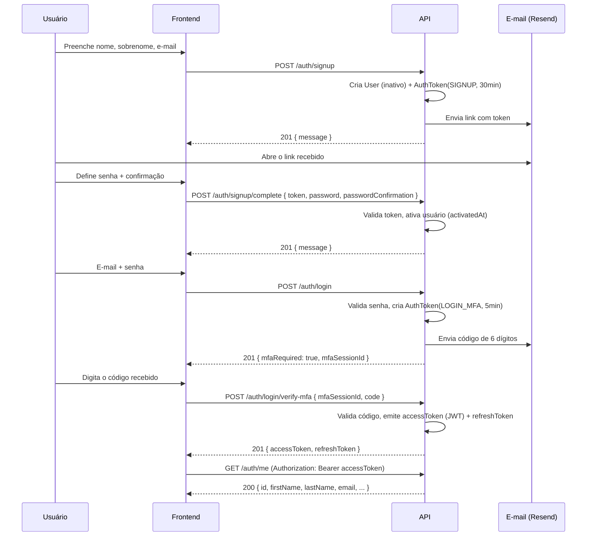

# Especificação — Módulo Auth

> Documentação "as-built" do módulo de autenticação implementado em `apps/api/src/auth`, testado ponta a ponta em 2026-09-17. Complementa o contrato geral em [`03-contratos-api.md`](03-contratos-api.md) com os detalhes reais de implementação, exemplos e regras de segurança.
>
> Documentação interativa (Swagger/OpenAPI) disponível em `GET /api/docs` quando a API está rodando.

## Visão geral do fluxo



## Endpoints

### `POST /auth/signup` — público
Cria o usuário (sem senha, inativo) e envia e-mail com link de confirmação.

**Request**
```json
{ "firstName": "Thiago", "lastName": "Souza", "email": "thiago@email.com" }
```
**Response `201`**
```json
{ "message": "Enviamos um e-mail de confirmação para concluir seu cadastro." }
```
Reenviar o cadastro para um e-mail já existente mas **não ativado** é permitido (atualiza nome/sobrenome e gera novo token). Para e-mail já **ativado**, retorna `409 Conflict`.

### `POST /auth/signup/complete` — público
**Request**
```json
{ "token": "<recebido por e-mail>", "password": "SenhaForte123", "passwordConfirmation": "SenhaForte123" }
```
**Response `201`**: `{ "message": "Cadastro concluído. Você já pode fazer login." }`
**Erros**: `400` se o token for inválido, expirado (30min) ou já usado.

### `POST /auth/login` — público
**Request**: `{ "email": "thiago@email.com", "password": "SenhaForte123" }`
**Response `201`**: `{ "mfaRequired": true, "mfaSessionId": "f9369476-1e45-47ee-982e-9ba2d9d3da9b" }`
**Erros**: `401` com mensagem genérica ("E-mail ou senha inválidos") tanto para e-mail inexistente quanto senha errada — evita enumeração de contas. Rate limit: 5 tentativas/min por IP.

### `POST /auth/login/verify-mfa` — público
**Request**: `{ "mfaSessionId": "f9369476-...", "code": "327953" }`
**Response `201`**
```json
{
  "accessToken": "eyJhbGciOi...",
  "refreshToken": "0e6021f4d91f06d698211bdf3d0d32233ddead043b426bda386e91e164cedd70"
}
```
**Erros**: `401` para código inválido/expirado. Após **5 tentativas** erradas na mesma sessão, o código é bloqueado e um novo login precisa ser iniciado. Rate limit: 10 tentativas/min por IP.

### `POST /auth/refresh` — requer refresh token válido
**Request**: `{ "refreshToken": "..." }` → **Response**: novo par `{ accessToken, refreshToken }`. O token antigo é revogado (rotação) — cada refresh token só pode ser usado uma vez.

### `POST /auth/logout`
**Request**: `{ "refreshToken": "..." }` → `204 No Content`. Revoga apenas a sessão daquele refresh token.

### `POST /auth/forgot-password` — público
**Request**: `{ "email": "thiago@email.com" }`
**Response `201`** (sempre, independente do e-mail existir): `{ "message": "Se o e-mail existir em nossa base, enviaremos um link para redefinição de senha." }`

### `POST /auth/reset-password` — público
**Request**: `{ "token": "...", "password": "...", "passwordConfirmation": "..." }`
**Response `201`**: `{ "message": "Senha alterada com sucesso. Faça login novamente." }`
Efeito colateral: **todos os refresh tokens do usuário são revogados** — desloga de todas as sessões, conforme o escopo.

### `POST /auth/change-password` — autenticado (`Authorization: Bearer <accessToken>`)
Sem corpo. Dispara o mesmo fluxo de `forgot-password` para o e-mail do próprio usuário logado (o escopo não pede a senha atual aqui — a confirmação é o próprio e-mail).

### `GET /auth/me` — autenticado
Retorna o perfil do usuário logado (sem `passwordHash`).
```json
{
  "id": "efe0d4e2-c8a0-4561-aa8d-eb4529690a3b",
  "firstName": "Thiago",
  "lastName": "Souza",
  "email": "thiago@email.com",
  "activatedAt": "2026-09-17T12:45:10.871Z",
  "themePreference": "SYSTEM",
  "createdAt": "2026-09-17T12:44:57.864Z",
  "updatedAt": "2026-09-17T12:45:10.875Z"
}
```

## Regras de segurança implementadas

| Item | Implementação |
|---|---|
| Hash de senha | `argon2id` (biblioteca `argon2`) |
| Hash de token/código OTP | `sha256` — não é preciso um hash lento aqui, pois o campo tem expiração curta e limite de tentativas |
| Token de cadastro | opaco (32 bytes aleatórios), expira em 30 min |
| Código de MFA | numérico de 6 dígitos, expira em 5 min, máx. 5 tentativas |
| Token de reset de senha | opaco, expira em 5 min |
| Refresh token | opaco (32 bytes), armazenado como hash no banco, expira em 30 dias, rotação a cada uso |
| Access token | JWT `HS256`, expira em 15 min, assinado com `JWT_ACCESS_SECRET` |
| Rate limiting | `@nestjs/throttler`: 100 req/min global; `login` 5/min; `verify-mfa` 10/min; `forgot-password` 5/min (por IP) |
| Anti-enumeração | `login` e `forgot-password` sempre respondem com mensagens genéricas |
| Logout total | `reset-password` revoga todos os refresh tokens do usuário |

## Testado manualmente em 2026-09-17

Fluxo completo executado contra um Postgres local (após recriar o banco `finance_app`, que continha schema de outro projeto): `signup` → `signup/complete` → `login` → `verify-mfa` → `GET /auth/me` autenticado. Todas as respostas conferidas manualmente; nenhum `passwordHash` exposto em nenhuma resposta.

## Pendências / próximos módulos

- `AuthModule` ainda não cobre: alteração de tema do usuário (`PATCH /users/me`), que fica para o módulo de Users/perfil.
- Testes automatizados (unitários/e2e) do módulo ainda não foram escritos — considerar antes de avançar para produção.
- `RefreshToken.userAgent`/`ip` estão no schema mas não são preenchidos ainda (úteis para a tela de "sessões ativas", se o produto vier a precisar).
